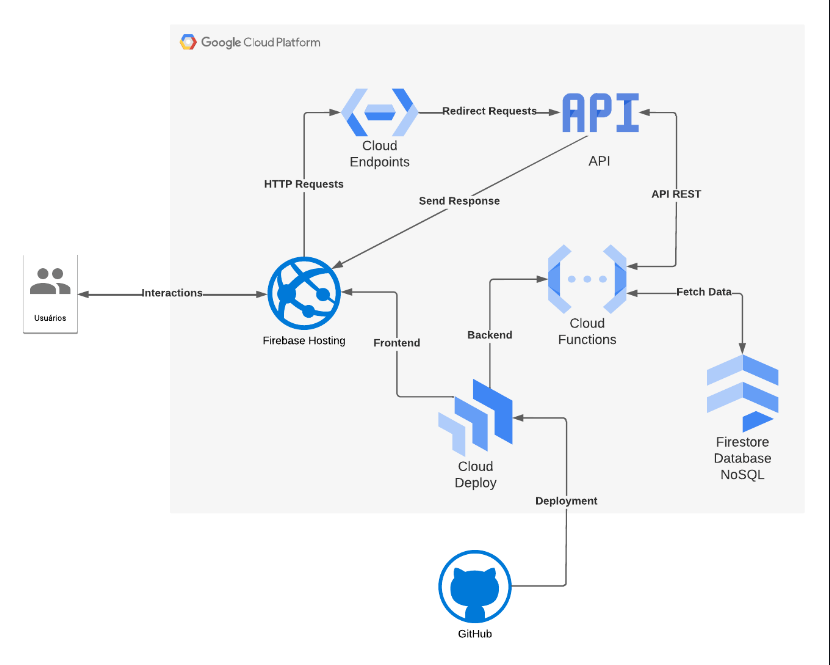
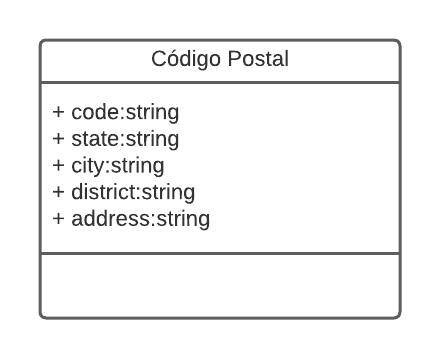

# skyler-mini-case

Website estático para consulta e armazenamentos de Códigos Postais.

## Sumário

1. [Branches](#branches)
2. [Levantamento de Requisitos](#levantamento-de-requisitos)
    1. [Requisitos Funcionais](#requisitos-funcionais)
    2. [Requisitos Não-Funcionais](#requisitos-não-funcionais)
3. [Arquitetura do Projeto](#arquitetura-do-projeto)
4. [Modelagem do Banco de Dados](#modelagem-do-banco-de-dados)
5. [Palheta de Cores](#palheta-de-cores)

## Branches

A estrutura de branches do projeto está organizada da seguinte forma:

- root
- front-end
- back-end

## Levantamento de Requisitos

### Requisitos Funcionais

<table>
    <tr>
        <th>ID</th>
        <th>Descrição</th>
    </tr>
    <tr>
        <td>#01</td>
        <td>CRUD de Código Postais</td>
    </tr>
    <tr>
        <td>#02</td>
        <td>Pesquisa de códigos</td>
    </tr>
</table>

### Requisitos Não-Funcionais

<table>
    <tr>
        <th>ID</th>
        <th>Descrição</th>
    </tr>
    <tr>
        <td>#01</td>
        <td>HTML, CSS, JavaScript</td>
    </tr>
    <tr>
        <td>#02</td>
        <td>ReactJS e React-Bootstrap</td>
    </tr>
    <tr>
        <td>#03</td>
        <td>NodeJS e ExpressJS</td>
    </tr>
    <tr>
        <td>#04</td>
        <td>Firebase - Hosting, Functions e Firestore Database (NoSQL)</td>
    </tr>
    <tr>
        <td>#05</td>
        <td>Controle de Versão - Github e Semantic Versioning</td>
    </tr>
</table>

## Arquitetura do Projeto

## Modelagem do Banco de Dados

## Palheta de Cores

